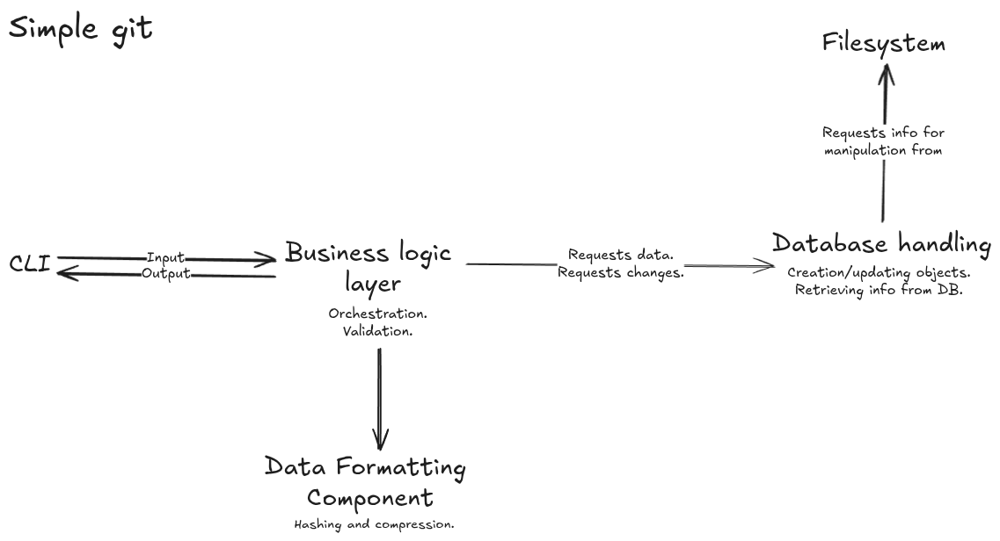

# A simple git-like version managing system.
## 1. A high level overview 
## User-visible outcomes

### Input
* User can initialize a repo
* User can copy the version tree (backup)
<!-- * User can update their version tree with newer version (import) -->

* User can stage 
    * Everything
    * Individual files
* User can unstage by the same rules

* User can commit
* User can revert commits (files return to staging)
* User can delete commits (no trace) (if last on a branch)

* User can branch
    * From last commit
    * From any other commit
<!-- * User can delete branches -->

* User can merge  (if no conflict)

* User can create tags
* User can delete tags

* User can create ignore lists (file based as well as individual files)

### Output
* User can view status of the repo they are in

* User can view the commit tree in a text-based format (with args specifying what data is shown)
* User can check the data of individual elements by their hash and name if applicable (all objects)
* User can view all and individual branches
* User can view all tags
* User can view all commits where a file was modified
* User can see what files differ:
    * Between commits
    * Between commit and staging
    * Between commit and working dir.
<!-- * User can view actual differences between files (path names) on individual level -->
* User can see all ignored files

## Modules

### CLI
1. **Parses input**
2. **Delivers output**

### Business logic handler
1. **Validates data**
2. **Passes ready data to DB handler for modifications**
3. **Passes ready data to CLI for output**

### Database handler
1. **Writes to DB**
2. **Retrieves from DB**

### Filesystem helpers
1. **Help DB access filesystem**

### Data processing (formatting) helpers
1. **Help business logic format data (hashing, compression)**

---
## 2. A high low-level plan 
